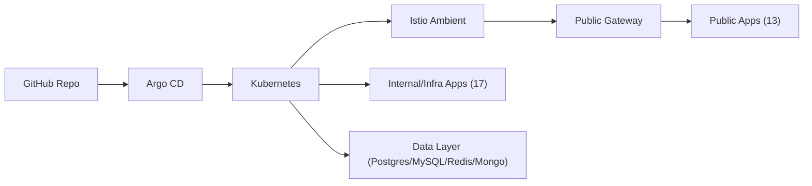

# HomeLab

  
  
  
  
  

## Topology

### Public Endpoints (13)

| App               | Namespace         | URL                         |
| ----------------- | ----------------- | --------------------------- |
| `root`            | `root`            | <https://lth.so>            |
| `argocd`          | `argocd`          | <https://argo.lth.so>       |
| `authentik`       | `authentik`       | <https://auth.lth.so>       |
| `badges`          | `badges`          | <https://badges.lth.so>     |
| `coder`           | `coder`           | <https://coder.lth.so>      |
| `grafana`         | `grafana`         | <https://monitoring.lth.so> |
| `kiali`           | `kiali`           | <https://kiali.lth.so>      |
| `kube-visualizer` | `kube-visualizer` | <https://visualized.lth.so> |
| `roundcube`       | `roundcube`       | <https://mail.lth.so>       |
| `slash`           | `slash`           | <https://s.lth.so>          |
| `spotify`         | `spotify`         | <https://spotify.lth.so>    |
| `wakapi`          | `wakapi`          | <https://wakatime.lth.so>   |
| `architecture`    | `architecture`    | <https://arch.lth.so>       |

### Internal/Infra Apps (17)

| App               | Namespace       | Role                        |
| ----------------- | --------------- | --------------------------- |
| `bridge`          | `bridge`        | Mail bridge                 |
| `cert-manager`    | `cert-manager`  | TLS certificate management  |
| `istio-base`      | `istio-system`  | Istio CRDs/base             |
| `istiod`          | `istio-system`  | Istio control plane         |
| `istio-cni`       | `istio-system`  | Istio CNI                   |
| `ztunnel`         | `istio-system`  | Ambient mesh data plane     |
| `istio-ingress`   | `istio-ingress` | Ingress gateway             |
| `prometheus`      | `prometheus`    | Metrics stack               |
| `sealed-secrets`  | `kube-system`   | Encrypted secret controller |
| `tailscale`       | `tailscale`     | Tailscale operator          |
| `technitium`      | `technitium`    | DNS server                  |
| `n8n`             | `n8n`           | Workflow automation         |
| `k8s-mcp` (`mcp`) | `default`       | Kubernetes MCP server       |
| `postgres`        | `postgres`      | PostgreSQL                  |
| `mysql`           | `mysql`         | MySQL                       |
| `redis`           | `redis`         | Redis                       |
| `mongo`           | `mongo`         | MongoDB                     |

## Repository Layout

| Path             | Description                          |
| ---------------- | ------------------------------------ |
| `apps/`          | Argo CD Application resource         |
| `argocd/`        | Argo CD ingress/traffic policy       |
| `istio-ingress/` | public gateway & ingress settings    |
| `database/`      | DB layer                             |
| `*/`             | each application deployment manifest |
