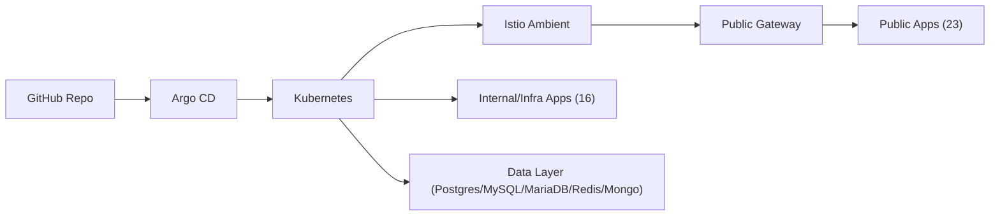

# HomeLab

  
  
  
  
  

GitOps-managed Kubernetes homelab manifests. Argo CD owns the applications, Istio Ambient provides the mesh, and the public surface is routed through Istio `VirtualService` resources.

## Topology

```mermaid
flowchart LR
  GitHub["GitHub Repo"] --> Argo["Argo CD"]
  Argo --> K8s["Kubernetes"]
  K8s --> Istio["Istio Ambient"]
  Istio --> Gateway["Public Gateway"]
  Gateway --> PublicApps["Public Apps (23)"]
  K8s --> InternalApps["Internal/Infra Apps (16)"]
  K8s --> Data["Data Layer (Postgres/MySQL/MariaDB/Redis/Mongo)"]
```

## Applications

Argo CD `Application` resources live under `apps/`. Each application points at an in-repo Kustomize path, a Helm chart, or both.

### Public Endpoints (23)

| App | Namespace | Primary URL | Aliases |
| --- | --- | --- | --- |
| `root` | `root` | <https://lth.so> | <https://limtaehyun.dev> |
| `argocd` | `argocd` | <https://argo.lth.so> | <https://argo.limtaehyun.dev> |
| `authentik` | `authentik` | <https://auth.lth.so> | <https://auth.limtaehyun.dev> |
| `badges` | `badges` | <https://badges.lth.so> | <https://badges.limtaehyun.dev> |
| `bridge` | `bridge` | <https://bridge.lth.so> | <https://bridge.limtaehyun.dev> |
| `doclane` | `doclane` | <https://book.lth.so> | - |
| `ghost` | `ghost` | <https://blog.lth.so> | - |
| `grafana` | `grafana` | <https://monitoring.lth.so> | <https://monitoring.limtaehyun.dev> |
| `kepco` | `kepco` | <https://kepco.lth.so> | - |
| `korail` | `korail` | <https://train.lth.so> | <https://train.limtaehyun.dev> |
| `kube-visualizer` | `kube-visualizer` | <https://visualized.lth.so> | <https://visualized.limtaehyun.dev> |
| `memos` | `memos` | <https://memo.lth.so> | <https://memo.limtaehyun.dev> |
| `n8n` | `n8n` | <https://workflow.lth.so> | <https://workflow.limtaehyun.dev> |
| `osmproxy` | `osmproxy` | <https://osm.lth.so> | - |
| `pmail` | `pmail` | <https://mail.lth.so> | - |
| `rustfs` | `rustfs` | <https://rustfs.lth.so> | <https://s3.lth.so>, `*.s3.lth.so` |
| `sikdae` | `sikdae` | <https://sikdae.lth.so> | - |
| `slash` | `slash` | <https://s.lth.so> | `s` |
| `spotify` | `spotify` | <https://spotify.lth.so> | <https://spotify.limtaehyun.dev> |
| `technitium` | `technitium` | <https://dns.lth.so> | - |
| `traccar` | `traccar` | <https://traccar.lth.so> | - |
| `tunnel` | `tunnel` | <https://tunnel.lth.so> | `*.tunnel.lth.so` |
| `wakapi` | `wakapi` | <https://wakatime.lth.so> | <https://wakatime.limtaehyun.dev> |

### Internal/Infra Apps (16)

| App | Namespace | Role |
| --- | --- | --- |
| `cert-manager` | `cert-manager` | TLS issuers and certificate automation |
| `gateway` | `kube-system` | Kubernetes Gateway API resources |
| `istio-base` | `istio-system` | Istio base chart |
| `istio-cni` | `istio-system` | Istio CNI chart |
| `istio-ingress` | `istio-ingress` | Public gateway, certificate, filters, and fallback routing |
| `istiod` | `istio-system` | Istio control plane with Ambient profile |
| `k8s-mcp` (`mcp`) | `default` | Kubernetes MCP server |
| `mariadb` | `mariadb` | MariaDB datastore |
| `mongo` | `mongo` | MongoDB datastore |
| `mysql` | `mysql` | MySQL datastore |
| `postgres` | `postgres` | Shared PostgreSQL datastore |
| `prometheus` | `prometheus` | Metrics, scraping, rules, and alert routing |
| `redis` | `redis` | Redis datastore |
| `sealed-secrets` | `kube-system` | Sealed Secrets controller |
| `tailscale` | `tailscale` | Tailscale connector and webfinger resources |
| `ztunnel` | `istio-system` | Istio Ambient node proxy |

## Repository Layout

| Path | Description |
| --- | --- |
| `apps/` | Argo CD `Application` resources |
| `argocd/` | Argo CD routing and destination policy |
| `database/` | Stateful backing services |
| `istio-ingress/` | Public gateway, certificate, Envoy filters, and wildcard fallback |
| `<app>/` | App-local Kustomize resources such as deployments, services, storage, secrets, and routing |
| `.github/workflows/argocd-diff.yml` | PR-time Argo CD diff workflow |

## Change Workflow

1. Update the target application manifests and its `apps/<name>.yml` entry when needed.
2. Open a pull request to `main`.
3. Review the Argo CD diff generated against `argo.lth.so`.
4. Merge after the diff matches the intended cluster state.
