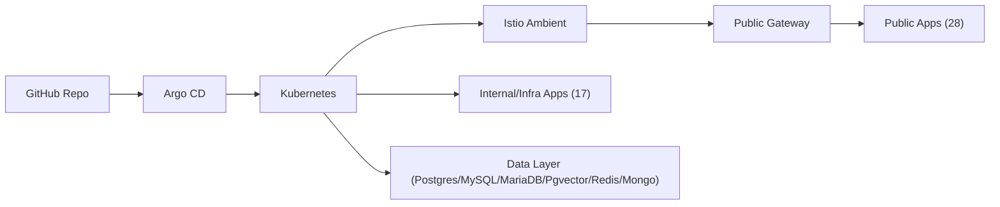

# HomeLab

  
  
  
  
  

## Topology

```mermaid
flowchart LR
  GitHub["GitHub Repo"] --> Argo["Argo CD"]
  Argo --> K8s["Kubernetes"]
  K8s --> Istio["Istio Ambient"]
  Istio --> Gateway["Public Gateway"]
  Gateway --> PublicApps["Public Apps (28)"]
  K8s --> InternalApps["Internal/Infra Apps (17)"]
  K8s --> Data["Data Layer (Postgres/MySQL/MariaDB/Pgvector/Redis/Mongo)"]
```

### Public Endpoints (28)

| App               | Namespace         | URL                         |
| ----------------- | ----------------- | --------------------------- |
| `root`            | `root`            | <https://lth.so>            |
| `argocd`          | `argocd`          | <https://argo.lth.so>       |
| `authentik`       | `authentik`       | <https://auth.lth.so>       |
| `booklore`        | `booklore`        | <https://book.lth.so>       |
| `badges`          | `badges`          | <https://badges.lth.so>     |
| `bridge`          | `bridge`          | <https://bridge.lth.so>     |
| `coder`           | `coder`           | <https://coder.lth.so>      |
| `couchdb`         | `couchdb`         | <https://couchdb.lth.so>    |
| `ghost`           | `ghost`           | <https://blog.lth.so>       |
| `grafana`         | `grafana`         | <https://monitoring.lth.so> |
| `kepco`           | `kepco`           | <https://kepco.lth.so>      |
| `kiali`           | `kiali`           | <https://kiali.lth.so>      |
| `kube-visualizer` | `kube-visualizer` | <https://visualized.lth.so> |
| `korail`          | `korail`          | <https://train.lth.so>      |
| `n8n`             | `n8n`             | <https://workflow.lth.so>   |
| `vnc`             | `vnc`             | <https://mac.lth.so>        |
| `memos`           | `memos`           | <https://memo.lth.so>       |
| `op-share`        | `op-share`        | <https://op.lth.so>         |
| `slash`           | `slash`           | <https://s.lth.so>          |
| `spotify`         | `spotify`         | <https://spotify.lth.so>    |
| `rustfs`          | `rustfs`          | <https://rustfs.lth.so>     |
| `termix`          | `termix`          | <https://terminal.lth.so>   |
| `technitium`      | `technitium`      | <https://dns.lth.so>        |
| `toolbox`         | `toolbox`         | <https://toolbox.lth.so>    |
| `traccar`         | `traccar`         | <https://traccar.lth.so>    |
| `tunnel`          | `tunnel`          | <https://tunnel.lth.so>     |
| `wakapi`          | `wakapi`          | <https://wakatime.lth.so>   |
| `architecture`    | `architecture`    | <https://arch.lth.so>       |

### Internal/Infra Apps (17)

| App               | Namespace       |
| ----------------- | --------------- |
| `cert-manager`    | `cert-manager`  |
| `gateway`         | `kube-system`   |
| `istio-base`      | `istio-system`  |
| `istio-cni`       | `istio-system`  |
| `istio-ingress`   | `istio-ingress` |
| `istiod`          | `istio-system`  |
| `k8s-mcp` (`mcp`) | `default`       |
| `mariadb`         | `mariadb`       |
| `mongo`           | `mongo`         |
| `mysql`           | `mysql`         |
| `pgvector`        | `pgvector`      |
| `postgres`        | `postgres`      |
| `prometheus`      | `prometheus`    |
| `redis`           | `redis`         |
| `sealed-secrets`  | `kube-system`   |
| `tailscale`       | `tailscale`     |
| `ztunnel`         | `istio-system`  |

## Repository Layout

| Path             | Description                          |
| ---------------- | ------------------------------------ |
| `apps/`          | Argo CD Application resource         |
| `argocd/`        | Argo CD ingress/traffic policy       |
| `istio-ingress/` | public gateway & ingress settings    |
| `database/`      | DB layer                             |
| `*/`             | each application deployment manifest |
